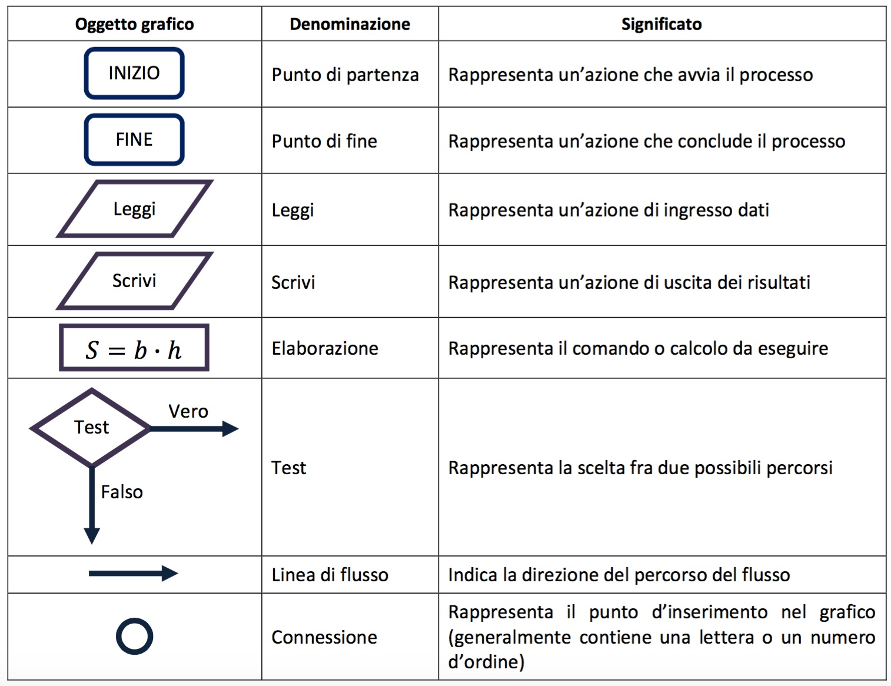

# Algoritmi

## Proprietà degli algoritmi

* Eseguibile
* Non ambiguo
* Finito
* Generalizzabile
* Efficiente
* Deterministico
* Completo

## Proprietà degli algoritmi 2

* Eseguibilità: ogni “istruzione” deve essere eseguibile da parte dell’esecutore dell’algoritmo;
* Non Ambiguità: ogni istruzione deve essere univocamente interpretabile dall'esecutore
* Finitezza: il numero totale di azioni da eseguire, per ogni insieme di dati di ingresso, è finito.
* se almeno una delle 3 proprietà non è soddisfatta, la sequenza non è un algoritmo.
* Generalità: corretto funzionamento dell'algoritmo anche variando alcuni aspetti del problema (ad esempio, la dimensione dell'insieme dei dati, il tipo dei * dati, ecc.)
* Efficienza: tanto minore è il numero di azioni eseguite per la risoluzione del problema, tanto maggiore è l'efficienza.
* Determinismo: possibilità di prevedere esattamente prima dell'esecuzione la sequenza di azioni che verranno eseguite, per ogni insieme di dati.

## Algoritmi e Programmi

Se l'esecutore è un elaboratore elettronico:

* È necessario conoscere l'insieme di istruzioni che è in grado di interpretare
* È necessario conoscere quali tipi di informazioni (dati) è in grado di rappresentare
* È necessario conoscere le caratteristiche del linguaggio di programmazione scelto

Dato un problema P, la sua soluzione può essere ottenuta mediante l’uso del calcolatore, compiendo i seguenti passi:

* individuazione di un metodo risolutivo
* scomposizione del procedimento in insieme ordinato di azioni: algoritmo
* rappresentazione dei dati e dell'algoritmo attraverso un linguaggio di programmazione comprensibile per l’elaboratore: programma

Si ottiene così il PROGRAMMA, che potrà essere eseguito dall'elaboratore per risolvere automaticamente ogni istanza del problema P.

## Algoritmi equivalenti

Due algoritmi si dicono equivalenti quando:

* hanno lo stesso dominio dei dati (dominio di ingresso);
* hanno lo stesso dominio dei risultati (dominio di uscita);
* in corrispondenza degli stessi valori nel dominio di ingresso producono gli stessi valori nel dominio di uscita

Due algoritmi equivalenti:

* forniscono lo stesso risultato
* possono essere profondamente diversi
* possono avere differente efficienza

## Rappresentare algoritmi

* un diagramma di flusso descrive le azioni da eseguire ed il loro ordine di esecuzione.
* ad ogni tipo di azione corrisponde ad un simbolo grafico (blocco) diverso.
* ogni blocco ha un ramo in ingresso ed uno o più rami in uscita; collegando tra loro i vari blocchi attraverso i rami, si ottiene un diagramma di flusso
* un diagramma di flusso appare, quindi, come un insieme di blocchi, collegati fra loro da linee orientate che specificano la sequenza in cui i blocchi * devono essere eseguiti: flusso del controllo di esecuzione.

## Oggetti grafici per rappresentare algoritmi

[003_ParadigmiLinguaggi](003_ParadigmiLinguaggi.md)
