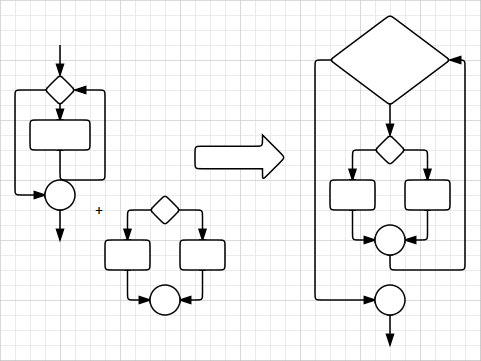

# Paradigmi di programmazione e linguaggi


## Teorema di Jacopini-Bohm (1966)

Un qualsiasi algoritmo può essere espresso utilizzando esclusivamente le tre strutture di controllo:

* sequenza, selezione e iterazione.




## Quanti Linguaggi...


## … e quanti paradigmi di programmazione


Un paradigma di programmazione è uno stile fondamentale di programmazione utile per portare ordine e criteri di lavoro più efficienti nella produzione dei programmi 

## La programmazione procedurale

* In informatica la programmazione procedurale è un paradigma di programmazione che consiste nel creare dei blocchi di codice sorgente, identificati da un nome e racchiusi da dei delimitatori, che variano a seconda del linguaggio di programmazione; 
* questi sono detti anche sottoprogrammi (in inglese subroutine) procedure o funzioni, a seconda del linguaggio e dei loro ruoli all'interno del linguaggio stesso.
* Il nome deriva dal linguaggio COBOL, che è stato il primo ad utilizzare questo concetto.

## La programmazione imperativa

* In informatica, la programmazione imperativa è un paradigma di programmazione secondo cui un programma viene inteso come un insieme di istruzioni (dette anche direttive o comandi), ciascuna delle quali può essere pensata come un "ordine" che viene impartito alla macchina virtuale del linguaggio di programmazione utilizzato. 
* Da un punto di vista sintattico, i costrutti di un linguaggio imperativo sono spesso identificati da verbi all'imperativo, per esempio:
	* 1: read i
	* 2: print i
	* 3: goto 1

## La programmazione strutturata

* La programmazione strutturata  è un paradigma emerso nella seconda metà degli anni '60, che ha introdotto i concetti fondamentali che sono alla base di tutti gli altri paradigmi successivi
* È una metodologia alternativa alla programmazione basata sul salto incondizionato (o goto) dei primi linguaggi di programmazione caratterizzato da codice praticamente incomprensibile spesso definito spaghetti code per la sua natura ingarbugliata. 

* le sole tre strutture fondamentali:

	* Struttura di sequenza
	* Struttura di selezione (o alternativa)
	* Struttura di iterazione (o ciclo, ripetizione).

## La programmazione funzionale

* le funzioni sono funzioni matematiche: per un dato input restituiscono sempre lo stesso risultato;
* le funzioni non modificano i dati ricevuti in input, ma restituiscono sempre nuovi valori;
* le funzioni possono essere passate come parametro e restituite da altre funzioni, e possono essere combinate tra di loro.

	Alcune funzioni sono definite non pure: sono funzioni che producono effetti collaterali:

	una interazione con il mondo esterno diversa dal ricevimento dei valori di input e dalla restituzione del risultato. 

	Ad esempio una funzione senza parametri che abbia come valore di ritorno la data corrente

Ne discende che:

* Una funzione senza parametri non è pura o non ha senso
* Una funzione senza un output non è pura

Invece le funzioni pure garantiscono la trasparenza referenziale: la capacità di sostituire una espressione con il suo risultato, mantenendo la correttezza dell’applicazione.

Sfruttando la trasparenza referenziale c’è la possibilità di utilizzare una tecnica detta *memoization*, che consiste nel mettere in cache risultati di funzioni che hanno un certo costo computazionale.

var funzioneMemoizzata = memoize(funzioneConCalcoliPesanti);

## Programmazione ad oggetti

**Procedurale vs OOP**

* Nella programmazione procedurale, il codice è centrale e i dati sono subordinati 
* abbiamo programmi che agiscono sui dati che di solito non sono strettamente collegati

* Nella programmazione a oggetti, gli oggetti sono l'elemento centrale. 
* Un oggetto consiste nei **dati** (attributi, proprietà, ...) 
* e nel codice che opera su tali dati: **metodi** 
* **dati e metodi** sono strettamente collegati: è il concetto di **incapsulamento**, che
* l'**incapsulamento** permette anche di nascondere l'implementazione interna, utilizzando l'oggetto attraverso l'**interfaccia** pubblica.

### Per esempio, 
abbiamo un numero e vogliamo raddoppiarlo. 

### Nel modo procedurale faremmo:

```java
n = n * 2
```

**Il codice moltiplica n per 2 e registra il risultato in n.**

### Nella programmmazione orientata agli oggetti

si invia un "messaggio" all'oggetto chiamando un metodo per raddoppiare:

```java
n.double();
```

puoi creare un oggetto di tipo stringa che accetta la chiamata al metodo `double()`, ma lo implementa in maniera differente. 

```java
class Operazioni{
	

	public int double(int n){
		return n * 2;
	}

	public String double(String s){
		return s+s;
	}

}
```

Il vantaggio di questa tecnica è definito **polimorfismo**.

Se il programma richiede di replicare la procedura su un oggetto di tipo string come "bob", 
nel modo procedurale occorre invocare una nuova funzione con un codice e un nome differente.

[vai alla sezione programmazione a oggetti](005_OOP.md)


[Teorema Jacopini Bohm](004_TeoremaJB.md)