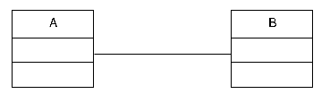
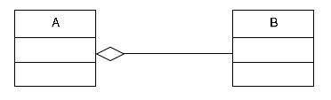
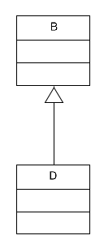

# I principi della OOP

* Definire nuovi tipi di dati.
* Incapsulare i valori e le operazioni.
* Riusare il codice esistente.
* Supportare il polimorfismo.

## L’oggetto

* un oggetto è una istanza di una classe.
* un oggetto deve essere conforme alla descrizione di una classe.
* un oggetto è contraddistinto da:
    1. attributi;
    2. metodi;
    3. identità;

* un oggetto non deve mai manipolare direttamente i dati di un altro oggetto
* la classe è una entità statica cioè a tempo di compilazione;
* l’oggetto è una entità dinamica cioè a tempo di esecuzione (run time);

## ADT (Abstract Data Types): creare nuovi tipi di oggetto

* i dati (o attributi)
    * contengono le informazioni di un oggetto;
* le operazioni (o metodi)
    * consentono di leggere/scrivere gli attributi di un oggetto;

## La descrizione di una classe

* La classe rappresenta la descrizione di un oggetto, contiene le definizioni di proprietà e metodi dell'oggetto che rappresenta.
* La classe consente di implementare gli ADT attraverso il meccanismo di incapsulamento.

* i dati devono rimanere privati insieme all’implementazione
* solo l’interfaccia delle operazioni è resa pubblica all’esterno della classe.

## Relazioni fra le classi

* uso: una classe può usare oggetti di un’altra classe;
* aggregazione: una classe può avere oggetti di un’altra classe;
* ereditarietà: una classe può estendere un’altra classe.

### Uso

* L’uso o associazione è la relazione più semplice che intercorre fra due classi.
* Per definizione diciamo che una classe A usa una classe B se:
    * un metodo della classe A invia messaggi agli oggetti della classe B , oppure
    * un metodo della classe A crea, restituisce, riceve oggetti della classe B .

### Aggregazione

* una classe A aggrega oggetti di una classe B quando la classe A contiene oggetti della classe B
* è un caso speciale della relazione di uso
* relazione has-a (ha-un)

### Ereditarietà

* riuso del codice
* classe derivata o sottoclasse
* classe base o superclasse
* relazione is-a (è-un)

#### si ottiene il riuso del codice

Consideriamo la classe base B che ha un metodo f(...) e la classe derivata D che eredita da B.
La classe D può usare il metodo f(...) in tre modi:

* lo eredita: quindi f(...) può essere usato come se fosse un metodo di D ;
* lo riscrive (override): cioè si da un nuovo significato al metodo riscrivendo la sua implementazione nella classe derivata, in modo che tale metodo esegua una azione diversa;
* lo estende: cioè richiama il metodo f(...) della classe base ed aggiunge altre operazioni.

### Quando usare l’ereditarietà

* Usare l’ereditarietà solo quando il legame fra la classe base e la classe derivata è per sempre, cioè dura per tutta la vita degli oggetti, istanze della classe derivata. 
* Se tale legame non è duraturo è meglio usare l’aggregazione al posto della specializzazione.

## Polimorfismo

* La parola polimorfismo deriva dal greco e significa letteralmente molte forme.
* Nella OOP tale termine si riferisce ai metodi: per definizione, il polimorfismo è la capacità di un oggetto, la cui classe fa parte di una gerarchia, di chiamare la versione corretta di un metodo.
* Quindi il polimorfismo è necessario quando si ha una gerarchia di classi.

## La programmazione orientata agli oggetti nei linguaggi

* [OOP in Java](https://github.com/maboglia/CorsoJava/tree/master/appunti)
* [OOP in PHP](https://github.com/maboglia/CorsoPHP/tree/master/appunti)
* [OOP in javascript](https://github.com/maboglia/Javascript2018/tree/master/appunti)
* [OOP vs Procedurale](005_DiffOOP_Procedurale.md)
