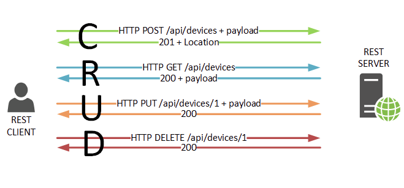

# **REST**

**REST** (**REpresentational State Transfer**) è una tipologia di archittettura software per sistemi client-server, il cui principio fondamentale è la separazione dei compiti fra le componenti distribuite del sistema, in modo da semplificarne l’implementazione eliminando ogni interdipendenza tra le stesse.

L’approccio proposto prevede che il sistema venga progettato seguendo i seguenti principi:

I dati e le funzionalità dell’applicazione devono essere rappresentate come risorse;

Ogni risorsa deve essere **univocamente identificabile e indirizzabile**, solitamente tramite l’uso di URL;

Le risorse devono essere accessibili attraverso un’interfaccia comune tra le varie componenti distribuite, che permetta di definire delle operazioni eseguibili.

L’approccio **REST** è **puramente concettuale** e implementabile con qualsiasi tecnologia e protocollo ne permetta di soddisfare i requisiti.

Un sistema che segue i principi dettati da **REST** viene comunemente definito **REST**ful.

Solitamente REST viene associato al **protocollo HTTP**: preferibile poiché estremamente diffuso e già utilizzato per trasferire “ipertesti” collocati a determinati indirizzi, 

inoltre ogni sua richiesta può essere completamente indipendente dalle altre e può specificare una determinata operazione (o metodo) da eseguire, rispettando così i principi REST.

I metodi definiti dallo standard HTTP sono utilizzati per indicare al server come manipolare la risorsa:

* **GET**: richiede una risorsa o una funzionalità
* **POST**: invia al server una nuova risorsa, solitamente per aggiungerla a quelle esistenti e assegnarle un nuovo identificatore
* **PUT** e PATCH: specificano al server le modifiche da effettuare su una risorsa esistente.
* **DELETE**: richiede la cancellazione di una risorsa.