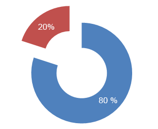

# You Aren't Gonna Need It

* Coding is about building things.
* 80% of the time spent on a software project is invested in 20% of the functionality.

* In ingegneria del software, l'espressione you aren't gonna need it, dall'inglese «non ne avrai bisogno», (spesso abbreviata in YAGNI) si riferisce ad un principio dell'extreme programming secondo cui un programmatore non dovrebbe sviluppare software che implementa funzionalità non esplicitamente richieste.
* Ron Jeffries ha formulato il principio con queste parole: 
* "Implementa qualcosa solo quando ne hai effettivamente bisogno, e mai solo perché prevedi che ne avrai bisogno"

[wikipedia](https://it.wikipedia.org/wiki/You_aren%27t_gonna_need_it)