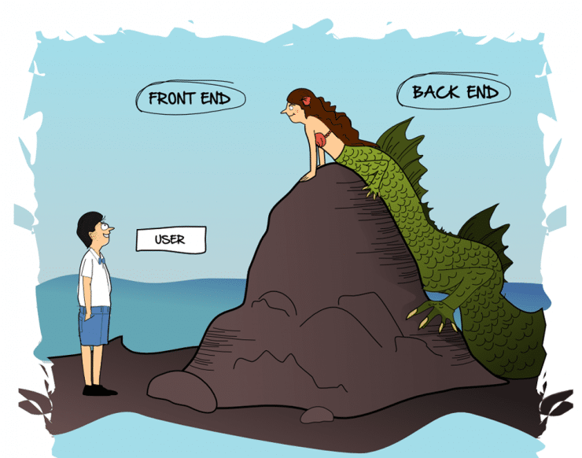

# front-end e back-end

## Front and back ends
*From Wikipedia, the free encyclopedia*

In software engineering, the terms front end and back end refer to the separation of concerns between the presentation layer (front end), and the data access layer (back end) of a piece of software, or the physical infrastructure or hardware. In the client–server model, the client is usually considered the front end and the server is usually considered the back end, even when some presentation work is actually done on the server. 

### Both

* Version control tools such as GitHub, SourceForge, or Mercurial
* File transfer tools and protocols such as FTP or rsync

### Front-end focused

* Markup and web languages such as HTML, CSS, JavaScript, and ancillary libraries commonly used in those languages such as Sass or JQuery
* Asynchronous request handling and AJAX
* Single-page applications (with frameworks like React, AngularJS or Vue.js)
* Web performance (first meaningful paint, time to interactive, 60 FPS animations and interactions, memory usage, etc)
* Responsive web design
* Cross-browser compatibility issues and workarounds
* End-to-end testing with a headless browser
* Build automation to transform and bundle JavaScript files, reduce images size... with tools like Webpack or Gulp.js
* Search engine optimization
* Accessibility concerns
* Basic usage of image editing tools such as GIMP or Photoshop

### Back-end focused

* Scripting languages like Node.js, PHP, Python, Ruby, or Perl or Compiled languages like C#, Java or Go,
* Automated testing frameworks for the language being used
* Application Data Access
* Application Business Logic
* Database administration
* Scalability
* Security concerns, authentication and authorization
* Data transformation
* Backup methods and software