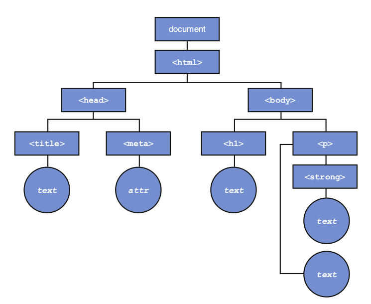
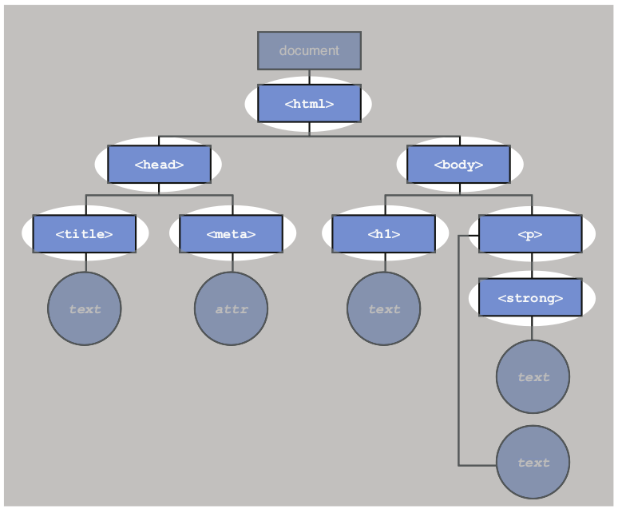
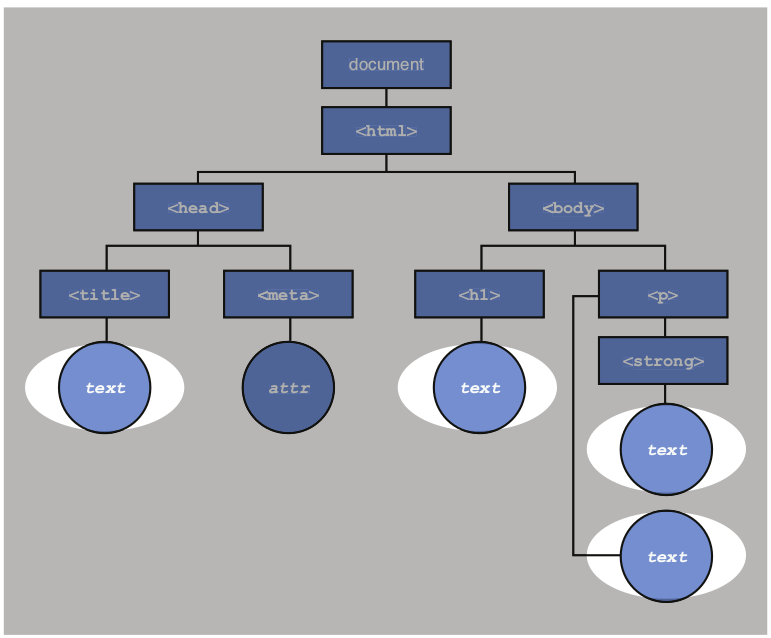
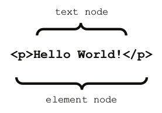
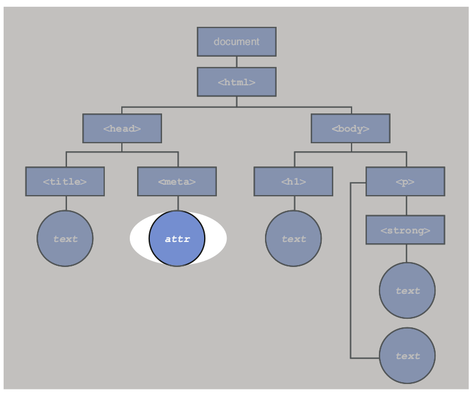
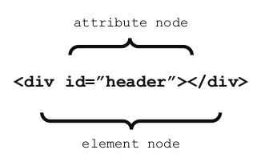

# **DOM** 

[DOM](img/HTML_DOM.png)

## [Document Object Model](https://it.wikipedia.org/wiki/Document_Object_Model)

In informatica il Document Object Model (spesso abbreviato come DOM), letteralmente modello a oggetti del documento, è una forma di rappresentazione dei documenti strutturati come modello orientato agli oggetti.

**DOM** è lo standard ufficiale del W3C per la rappresentazione di documenti strutturati in maniera da essere neutrali sia per la lingua che per la piattaforma. 

**DOM** è inoltre la base per una vasta gamma di interfacce di programmazione delle applicazioni; alcune di esse sono standardizzate dal W3C.

Secondo il **DOM**, un documento è rappresentato da un albero che può essere visitato, modificato e trasformato mediante strumenti specifici.

I nodi dell’albero sono di varia natura:

* nodi documento (document nodes)
* nodi elemento (element nodes)
* nodi testo (text nodes)
* nodi attributo (attribute nodes)
* ...

[Vedi documento dedicato al DOM](http://moodle.its-ictpiemonte.it/pluginfile.php/2353/mod_resource/content/1/2016_webstandard2_DOM.pdf)


### DOM Document Object Model

```html
<!DOCTYPE html>
<html>
	<head>
		<meta charset= "utf-8 ">
		<title>Basic DOM example</title>
	</head>
	<body>
		<h1>Hello World!</h1>
		<p>While this is a <strong>very basic HTML document</strong>, 		it actually serves as a detailed example of the document object 			model.</p>
</body>
</html>
```

### DOM

### element_nodes

### text_nodes


### attribute_nodes


