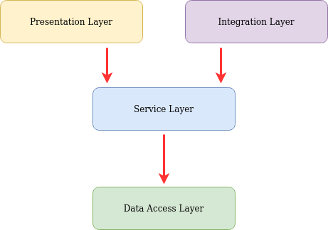

# Architettura multi-tier

Three-tier architecture ha i seguenti tre livelli:

## Livello di presentazione

* Questo è il livello più alto dell'applicazione. 
* Il livello di presentazione mostra le informazioni relative a servizi come merce online, acquisti, e i contenuti del carrello della spesa. 

* Comunica con altri livelli attraverso i risultati di output al livello browser/client e tutti gli altri livelli della rete.
*  il livello presentazione può essere stratificato con il pattern MVC o MVVM.
*  In un'architettura three-tier che utilizza il pattern MVC o MVVM per il livello presentazione, il model (sorgente dei dati) è rappresentato dal **livello applicazione** o da un **servizio** che fa da ponte tra il livello presentazione e livello applicazione.
*  In un'architettura single-tier il model può essere invece direttamente rappresentato dal database. 

## Livello applicazione 

* (**business logic**, la logica di primo livello, l'accesso ai dati di secondo livello, o di livello intermedio)

* La logica di primo livello viene tirato fuori dal livello di presentazione e, come suo proprio livello, controlla la funzionalità di un'applicazione eseguendo elaborazioni dettagliate.

## Livello dati

* Questo livello è costituito da server **database**. 
* Qui le informazioni vengono memorizzate e recuperate. 
* Questo livello mantiene i dati neutrali e indipendenti da applicazioni server o da logica di business. 
* Fornendo informazioni del proprio livello inoltre migliora la scalabilità e le prestazioni.

[wikipedia](https://it.wikipedia.org/wiki/Architettura_multi-tier)

