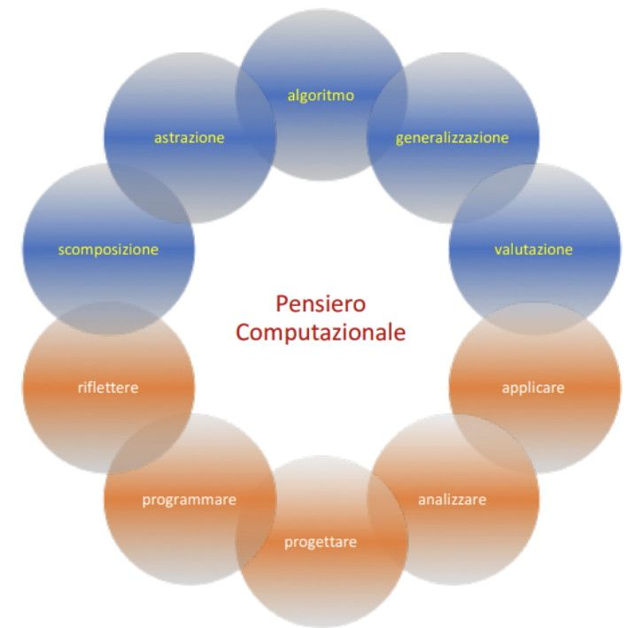

# Pensiero computazionale

Il pensiero computazionale è l'insieme dei processi mentali coinvolti nella formulazione di un problema e della sua soluzione(i) in modo tale che un umano o una macchina possano effettivamente eseguirla.

Il pensiero computazionale è un processo iterativo basato su tre fasi:

* Formulazione del problema (astrazione);
* Espressione della soluzione (automazione);
* Esecuzione della soluzione e valutazione della stessa (analisi).

La storia del pensiero computazionale risale almeno agli anni 1950, ma la maggior parte delle idee risale a molto prima.

Il termine pensiero computazionale è stato utilizzato per la prima volta da Seymour Papert nel 1980 nel suo libro "Mindstorms" e, successivamente, formalizzato dall'informatica americana Jeanette Wing in un articolo del 2006.[1].

[wikipedia](https://it.wikipedia.org/wiki/Pensiero_computazionale)