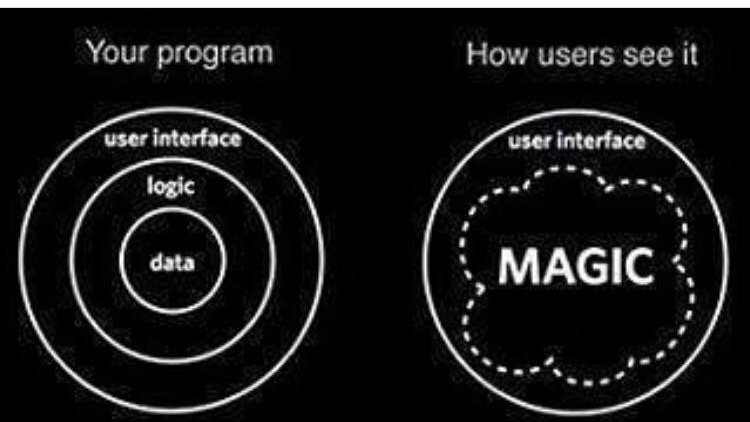
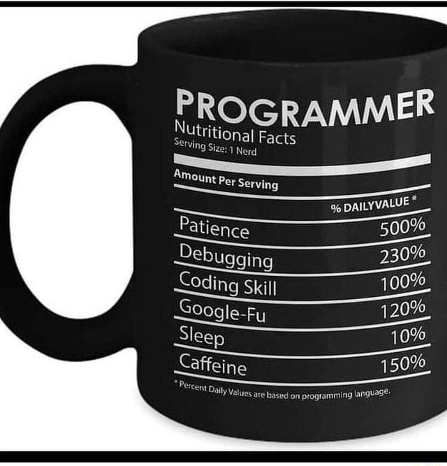

# "Fondamenti di Programmazione: Introduzione al Pensiero Logico e alla Scrittura di Codice"

### Mauro Bogliaccino

---

### Descrizione del Corso

Il corso "Fondamenti di Programmazione" è progettato per gli studenti post diploma che desiderano acquisire competenze di base nel campo della programmazione. Questo corso fornisce una solida base introduttiva per comprendere i concetti di base della programmazione e sviluppare le competenze necessarie per scrivere codice.

---



### Obiettivi del Corso

1. **Introduzione alla Logica di Programmazione**: Fornire una comprensione approfondita dei principi fondamentali della logica di programmazione, inclusi algoritmi, strutture dati e logica di controllo.
2. **Fondamenti dei Linguaggi di Programmazione**: Presentare concetti chiave dei linguaggi di programmazione, esplorando sintassi, variabili, operatori e strutture di base.

---

3. **Sviluppo di Competenze Pratiche**: Offrire esperienze pratiche con l'implementazione di codice, esercizi guidati e progetti per applicare le conoscenze acquisite.
4. **Problem-Solving e Pensiero Algoritmico**: Inculcare capacità di risolvere problemi, logica critica e sviluppare pensiero algoritmico per affrontare sfide di programmazione.
5. **Preparazione per Corsi Avanzati**: Creare una base solida per lo studio di corsi avanzati di programmazione o per l'ingresso nel mondo del lavoro nel settore informatico.

---



---

### Argomenti del Corso

1. **Introduzione alla Programmazione**: Concetti base, storia della programmazione, ruolo della programmazione nel mondo moderno.
2. **Algoritmi e Strutture Dati**: Concetti fondamentali di algoritmi, vari tipi di dati e strutture dati.
3. **Sintassi e Concetti dei Linguaggi di Programmazione**: Variabili, tipi di dati, operatori, istruzioni di controllo.

---

4. **Programmazione Orientata agli Oggetti**: Concetti fondamentali e struttura di base della programmazione orientata agli oggetti.
5. **Esperienze Pratiche e Progetti Guidati**: Sviluppo di progetti per applicare le conoscenze acquisite.
6. **Risorse e Strumenti**: Uso di IDE, risorse online e librerie per la programmazione.

---

### Modalità di Insegnamento

1. **Lezioni Frontali**: Lezioni teoriche per spiegare i concetti di base.
2. **Esercitazioni Pratiche**: Attività pratiche e laboratori guidati per applicare le conoscenze.
3. **Progetti e Assegnazioni**: Sviluppo di progetti per mettere in pratica ciò che è stato appreso.
4. **Discussioni e Collaborazione**: Sessioni interattive per discutere problemi e soluzioni, promuovere la collaborazione tra studenti.

---

### Requisiti

1. **Conoscenze Preliminari**: Nessuna conoscenza pregressa richiesta.
2. **Requisiti Tecnici**: Computer con accesso a Internet per partecipare alle lezioni e svolgere le attività pratiche.

---

### Risultati Attesi

Al termine del corso "Fondamenti di Programmazione", gli studenti saranno in grado di comprendere i concetti di base della programmazione, scrivere codice semplice e risolvere problemi elementari utilizzando un linguaggio di programmazione. Questo corso fornirà una base solida per ulteriori studi nel campo della programmazione o per l'ingresso nel mondo del lavoro nell'ambito informatico.

---

### Titolo della Lezione

**Introduzione alla Logica di Programmazione e Algoritmi**

---

### Obiettivi della Lezione

- Presentare i concetti di base della logica di programmazione e degli algoritmi.
- Comprendere l'importanza della logica nell'ambito della programmazione.
- Introdurre gli studenti ai principi fondamentali degli algoritmi.

---

### Struttura della Lezione

1. **Presentazione Teorica (30 min)**:
   - **Cos'è la Logica di Programmazione?** Definizione e importanza nella scrittura di codice.
   - **Principi degli Algoritmi** Introduzione ai passi logici per risolvere problemi.
   - **Tipi di Algoritmi** Descrizione di algoritmi comuni.

---

2. **Esercitazione Pratica (40 min)**:
   - **Esercizi di Logica** Esercizi guidati per comprendere la struttura logica di base.
   - **Risoluzione di Problemi** Attività per applicare i concetti di algoritmi.

---

3. **Discussione e Q&A (15 min)**:
   - **Sessione Interattiva** Risoluzione di dubbi e discussione su esempi specifici.
   - **Domande e Risposte** Rispondere alle domande degli studenti e chiarire eventuali dubbi.

---

### Materiale Didattico

1. Presentazione in PowerPoint: Introduzione teorica con slide illustrative.
2. Fogli di Esercizi: Esercizi di logica e problemi di algoritmi da risolvere.
3. Lavagna o Software di Lavagna Interattiva: Utilizzata per dimostrare passi logici e risoluzione di esempi.

---

### Attività

1. **Spiegazione Teorica**: Introduzione teorica su logica di programmazione e algoritmi.
2. **Esercitazione Pratica**: Lavoro in piccoli gruppi per risolvere esercizi di logica e problemi di algoritmi.
3. **Discussione e Q&A**: Sessione interattiva per chiarire dubbi e domande.

---

### Metodologia Didattica

La lezione sarà condotta utilizzando una combinazione di presentazioni teoriche, esercitazioni pratiche e sessioni interattive. Si incoraggerà la partecipazione degli studenti, sia attraverso attività di gruppo che tramite domande e risposte.

---

## Programma del corso

### 1: Introduzione al Corso

- Titolo: "Fondamenti di Programmazione: Introduzione al Pensiero Logico e alla Scrittura di Codice"
- Breve presentazione del corso e degli obiettivi della lezione.
- Immagini rappresentative della programmazione e del pensiero logico.

---

### 2: Cos'è la Programmazione?

- Definizione di base della programmazione.
- Importanza della programmazione nella tecnologia moderna.
- Esempi di applicazioni e campi in cui la programmazione è fondamentale.

---

### 3: Importanza della Logica nella Programmazione

- Ruolo della logica nella scrittura del codice.
- Esempi di come la logica è applicata nella programmazione.
- Diagrammi logici e la loro importanza nella comprensione della logica di programmazione.

---

### 4: Concetti di Base degli Algoritmi

- Definizione di algoritmi.
- Esempi di algoritmi semplici nella vita quotidiana.
- Illustrazione dei passaggi logici di base in un algoritmo.

---

### 5: Strutture Dati e Logica di Controllo

- Spiegazione delle strutture dati e del loro ruolo nella programmazione.
- Logica di controllo: presentazione delle istruzioni di base (if, else, for, while).
- Esempi di utilizzo delle strutture dati e della logica di controllo.

---

### 6: Principi della Logica di Programmazione

- Principi fondamentali della logica di programmazione.
- Diagrammi di flusso: introduzione e importanza nella programmazione.
- Esempi pratici di come applicare la logica di programmazione.

---

### 7: Esempi e Applicazioni Pratiche

- Casistiche pratiche per dimostrare l'uso della logica nella programmazione.
- Esempi di problemi risolti con l'applicazione dei concetti illustrati.

---

### 8: Pensiero Algoritmico e Problem-Solving

- Definizione e importanza del pensiero algoritmico.
- Processo di problem-solving nella programmazione.
- Esempi di come affrontare problemi e risolverli logicamente.

---

### 9: Conclusione e Prossimi Passi

- Riassunto dei punti chiave coperti nella lezione.
- Indicazioni su come i concetti introdotti verranno ulteriormente sviluppati nel corso.
- Invito alla partecipazione e coinvolgimento attivo degli studenti.


---

## argomenti fondamentali del corso

Gli argomenti fondamentali del corso "Fondamenti di Programmazione" includono concetti e costrutti basilari che costituiscono le fondamenta della programmazione. Questi argomenti sono cruciali per comprendere come scrivere codice e risolvere problemi utilizzando linguaggi di programmazione. Ecco una lista degli argomenti principali:

---

### Concetti Base

1. **Variabili e Tipi di Dati**: Introduzione alle variabili, tipi di dati (int, float, string, boolean) e la loro dichiarazione e utilizzo.
2. **Costanti**: Valori immutabili definiti una volta e non modificabili durante l'esecuzione del programma.
3. **Operatori**: Operatori aritmetici, relazionali e logici per effettuare operazioni matematiche e logiche.

---

### Strutture di Controllo

4. **Istruzioni Condizionali (if-else)**: Controllo del flusso del programma basato su condizioni.

5. **Cicli (for, while)**: Iterazioni per eseguire blocchi di codice ripetutamente fino a che una condizione è soddisfatta.

---

### Funzioni

6. **Definizione e Chiamata di Funzioni**: Creazione e utilizzo di funzioni per organizzare e riutilizzare il codice.

7. **Parametri e Argomenti delle Funzioni**: Utilizzo di parametri per passare dati a una funzione.

---

### Strutture Dati

8. **Array**: Raccolta ordinata di elementi dello stesso tipo con accesso tramite indice.

9. **Collezioni**: Concetto più generale di insiemi di dati, come liste, mappe, insiemi, code.

---

### Programmazione Orientata agli Oggetti (OOP)

10. **Classi e Oggetti**: Concetti fondamentali di OOP, con oggetti come istanze di classi.

11. **Ereditarietà**: Estensione delle classi esistenti per creare nuove classi.

12. **Incapsulamento e Polimorfismo**: Concetti avanzati per gestire la visibilità e la flessibilità del codice.

---

### Gestione degli Errori

13. **Gestione delle Eccezioni**: Come affrontare e gestire situazioni eccezionali o errori durante l'esecuzione del programma.

---

### Input/Output

14. **Lettura e Scrittura su File**: Interazione con file esterni per leggere o scrivere dati.

---

### Logica di Programmazione

15. **Algoritmi e Strutture Dati**: Concetti fondamentali nella risoluzione dei problemi, come ordinamento, ricerca e gestione dei dati.

---

### Una solida base

Questi argomenti forniscono una base solida per affrontare problemi di programmazione e costituiscono il nucleo di molti linguaggi di programmazione. L'apprendimento di questi concetti fornisce una comprensione essenziale per poter scrivere codice e risolvere problemi in modo efficiente attraverso la programmazione

---

## I linguaggi di programmazione

Per la parte pratica dei fondamenti di programmazione, diversi linguaggi possono essere adatti per insegnare i concetti base. La scelta dipende dall'obiettivo del corso, dalla facilità di apprendimento e dalla versatilità del linguaggio stesso. Ecco alcuni linguaggi comuni e le relative considerazioni:

---

Ogni linguaggio di programmazione ha caratteristiche uniche, punti di forza e applicazioni specifiche. Ecco una panoramica sui linguaggi di programmazione più diffusi:

---

### 1. Python

- **Semplicità e Leggibilità**: Con una sintassi chiara e intuitiva, è noto per essere facile da imparare e leggere.
- **Versatilità**: Utilizzato in diversi campi come sviluppo web, intelligenza artificiale, analisi dati e automazione.
- **Ampia Comunità e Librerie**: Vanta una vasta gamma di librerie che semplificano lo sviluppo.

---

### 2. JavaScript

- **Linguaggio Web Principale**: Utilizzato principalmente per sviluppare applicazioni web e interazioni dinamiche sul front-end.
- **Supporto dei Browser**: È il principale linguaggio di scripting per browser web e consente l'interattività su pagine web.
- **Node.js**: Estensione server-side che consente lo sviluppo di applicazioni back-end.

---

### 3. Java

- **Portabilità**: Con il motto "Write Once, Run Anywhere", è noto per la sua portabilità e capacità di funzionare su diverse piattaforme.
- **Applicazioni Enterprise**: Utilizzato per lo sviluppo di applicazioni enterprise, giochi e applicazioni Android.

---

### 4. C++

- **Efficienza e Velocità**: È apprezzato per le prestazioni elevate e l'efficienza, utilizzato in sistemi embedded, motori di gioco, e software ad alte prestazioni.
- **Complessità**: Può essere più complesso da imparare rispetto ad altri linguaggi.

---

### 5. C#

- **Framework .NET**: Utilizzato per sviluppare applicazioni Windows e applicazioni web ASP.NET.
- **Gioco e Applicazioni Desktop**: Comunemente usato per sviluppare giochi e applicazioni desktop.

---

### 6. PHP

- **Sviluppo Web Back-End**: Utilizzato principalmente per lo sviluppo back-end di siti web, in particolare con CMS come WordPress.
- **Facilità di Integrazione**: Supporta un'ampia gamma di database e integrazioni di terze parti.

---

### 7. Ruby

- **Semplicità e Produttività**: Con il framework Ruby on Rails, offre uno sviluppo rapido e facilità d'uso.
- **Web Development**: Utilizzato per lo sviluppo web, promuovendo la scrittura di codice pulito e l'adozione di best practices.

---

### 8. Swift (per lo sviluppo iOS)

- **Sviluppo iOS e macOS**: Linguaggio principale per la creazione di applicazioni per dispositivi Apple.
- **Sicurezza e Prestazioni**: Ha un'enfasi sulla sicurezza del software e offre prestazioni elevate.

Ogni linguaggio di programmazione ha i suoi punti di forza e può essere più adatto per specifiche applicazioni o contesti. La scelta del linguaggio dipende spesso dal tipo di progetto e dalle preferenze personali.

---

### Considerazioni Finali

La scelta del linguaggio dipende anche dagli obiettivi futuri. Se il corso è un'introduzione generale ai concetti di programmazione, Python potrebbe essere una scelta ideale per la sua facilità di apprendimento e versatilità. Tuttavia, se c'è un interesse specifico nell'ambito web o nell'ingegneria del software, JavaScript o Java potrebbero essere più appropriati. Scratch è più adatto per un pubblico più giovane o per chi si avvicina per la prima volta al concetto di programmazione.

---

# Paradigmi

La Programmazione Orientata agli Oggetti (OOP) è un paradigma di programmazione che si basa su concetti come oggetti, classi e relazioni tra di essi. È uno dei concetti più importanti nella programmazione e offre un modo organizzato ed efficiente per scrivere codice più facilmente mantenibile e riutilizzabile. I principi fondamentali della programmazione orientata agli oggetti includono:

---

### Concetti Principali della Programmazione Orientata agli Oggetti

#### 1. **Classe:**

- Una classe rappresenta un modello da cui vengono creati gli oggetti.
- Contiene attributi (variabili di istanza) e metodi (funzioni).

---

#### 2. **Oggetto:**

- Un'istanza di una classe che rappresenta un'entità reale o concettuale.
- Gli oggetti hanno stato (attributi) e comportamento (metodi).

---

#### 3. **Incapsulamento:**

- Nasconde l'implementazione e i dettagli interni dell'oggetto.
- Si accede agli attributi e ai metodi attraverso un'interfaccia pubblica.

---

#### 4. **Ereditarietà:**

- Permette a una classe (sottoclasse) di ereditare attributi e metodi da un'altra classe (superclasse).
- Aiuta a riusare il codice e a organizzare le classi in una gerarchia.

---

#### 5. **Polimorfismo:**

- Capacità di oggetti di classi diverse di rispondere allo stesso messaggio o comportamento in modi diversi.
- Metodi con lo stesso nome ma comportamenti diversi in classi diverse.

---

### Esempio

```java
// Definizione di una classe in Java
class Automobile {
    // Attributi della classe
    private String marca;
    private String modello;

    // Metodo costruttore
    public Automobile(String marca, String modello) {
        this.marca = marca;
        this.modello = modello;
    }

    // Metodi della classe
    public String getMarca() {
        return marca;
    }

    public String getModello() {
        return modello;
    }
}
// Creazione di un oggetto
Automobile auto = new Automobile("Toyota", "Corolla");
System.out.println(auto.getMarca()); // Output: Toyota
```

---

### "Creazione di un oggetto"

Nell'esempio, `Automobile` è una classe che definisce un modello di un'automobile. Viene creato un oggetto `auto` utilizzando il costruttore della classe, e vengono chiamati i metodi `getMarca()` e `getModello()` per ottenere i dettagli dell'automobile.

---

### facilita la manutenzione

La programmazione orientata agli oggetti favorisce la creazione di codice modulare, facilita la manutenzione e permette di gestire in modo efficiente complessità crescenti nei progetti software. La comprensione di questi concetti è fondamentale per molti linguaggi di programmazione moderni.

---

# La Programmazione Procedurale

La Programmazione Procedurale è un paradigma di programmazione che si concentra sull'organizzazione di un programma utilizzando procedure o funzioni per eseguire operazioni specifiche. Si basa sulla sequenza di istruzioni per creare programmi e suddivide il codice in blocchi di istruzioni eseguite in ordine.

---

### Concetti Principali della Programmazione Procedurale

#### 1. **Procedure e Funzioni:**

- Le procedure (o funzioni) sono blocchi di istruzioni che eseguono compiti specifici.
- Le funzioni possono restituire valori e/o effettuare azioni.

---

#### 2. **Variabili e Strutture di Controllo:**

- Utilizza variabili per memorizzare dati e utilizza le istruzioni di controllo come condizionali (if-else) e cicli (for, while) per gestire il flusso del programma.

---

#### 3. **Programmazione Sequenziale:**

- Il programma è strutturato in sequenza, con istruzioni eseguite una dopo l'altra.

---

#### 4. **Modularità e Riutilizzo del Codice:**

- La programmazione procedurale favorisce la modularità organizzando il codice in funzioni riutilizzabili.

---

### Esempio

```c
#include <stdio.h>

// Definizione di una funzione in C
void saluta() {
    printf("Ciao, benvenuto alla programmazione procedurale!\n");
}

int main() {
    // Chiamata alla funzione saluta()
    saluta();
    return 0;
}
```

---

### flusso sequenziale

Nell'esempio sopra, il programma in C utilizza una funzione `saluta()` per stampare un messaggio di saluto. Il programma segue un flusso **sequenziale** e richiama la funzione `saluta()` all'interno della funzione `main()`.

---

### decomposizione

La programmazione procedurale si concentra sulla **decomposizione** di un problema in procedure più piccole, rendendo più facile la comprensione e la gestione di progetti di dimensioni moderate. Tuttavia, a differenza della programmazione orientata agli oggetti, non è incentrata su concetti come l'incapsulamento, l'ereditarietà o il polimorfismo.

---

### Linguaggi multiparadigma

Sebbene la programmazione procedurale sia stata una pratica comune in passato, molti linguaggi moderni, come Java, C++, Python, ecc., offrono supporto per entrambi i paradigmi, combinando gli aspetti della programmazione procedurale con quelli dell'OOP per creare codice più organizzato e manutenibile.

---

# pensiero computazionale

Il pensiero computazionale è una capacità cognitiva che coinvolge la formulazione di problemi in modo che possano essere risolti attraverso soluzioni che sfruttano i concetti e i modelli provenienti dall'informatica. Non è limitato solo al campo dell'informatica, ma può essere applicato a una vasta gamma di problemi, sia tecnici che non tecnici.

---

### Caratteristiche chiave del pensiero computazionale

1. **Scomposizione dei Problemi**: Si tratta di analizzare e scomporre un problema complesso in problemi più piccoli e più gestibili, facilitando la risoluzione del problema principale.

---

2. **Ricorsione e Iterazione**: Utilizza il concetto di ricorsione (la capacità di una funzione di richiamare se stessa) e iterazione (cicli) per risolvere problemi.

---

3. **Modelli Mentali e Astrazione**: Coinvolge la capacità di costruire modelli astratti per rappresentare e risolvere un problema senza entrare nei dettagli più specifici.

---

4. **Algoritmi e Procedure**: Comprende la creazione e l'utilizzo di algoritmi e procedure per risolvere problemi in modo sequenziale.

---

5. **Pensiero Logico e Analitico**: Coinvolge un'approccio logico e analitico alla risoluzione di problemi, basato su sequenze di istruzioni o passaggi logici.

---

### Applicazioni del Pensiero Computazionale

- **Risolvere Problemi Complessi**: Applicando la scomposizione e l'astrazione per risolvere questioni complesse in varie discipline.
- **Automazione e Ottimizzazione**: Utilizzo di algoritmi e procedure per automatizzare e ottimizzare processi.
- **Pensiero Creativo e Innovativo**: L'uso del pensiero computazionale per stimolare la creatività e l'innovazione in diversi campi.

---

### Importanza del Pensiero Computazionale

Il pensiero computazionale non è solo rilevante nell'informatica, ma è un'abilità trasversale che può essere utile in diversi ambiti della vita e del lavoro. Aiuta a sviluppare abilità di problem-solving, pensiero critico, analitico e logico, essenziali per affrontare le sfide moderne.

---

### approccio diffuso

Inoltre, molte discipline, dall'ingegneria alla medicina, dall'economia alla biologia, stanno adottando il pensiero computazionale per risolvere problemi complessi e per trovare soluzioni efficienti e innovative. È una competenza cruciale che può essere insegnata e appresa per affrontare con successo i problemi della vita quotidiana e del mondo del lavoro.

---

# gli algoritmi

Gli algoritmi sono una serie di istruzioni o regole logiche strutturate che definiscono un insieme di operazioni necessarie per risolvere un problema o eseguire un'attività. Gli algoritmi sono alla base della programmazione e della risoluzione dei problemi e forniscono un metodo preciso per risolvere un problema in un numero finito di passaggi.

---

### Caratteristiche degli algoritmi

1. **Chiarezza e Precisione**: Gli algoritmi devono essere chiari, ben definiti e comprensibili per essere eseguiti correttamente.

2. **Finiti e Deterministici**: Gli algoritmi devono avere un numero finito di passaggi e generare sempre lo stesso risultato per lo stesso input.

---

3. **Entrata e Uscita**: Ogni algoritmo ha un input, su cui opera, e un'uscita, che è il risultato dell'elaborazione dell'algoritmo.

4. **Sequenziale e Modulare**: Gli algoritmi seguono un flusso sequenziale di istruzioni e possono essere modulati in blocchi più piccoli per facilitarne la comprensione e il riutilizzo.

5. **Efficienza**: Gli algoritmi dovrebbero essere scritti in modo da ottenere il risultato in modo efficiente e ottimale.

---

### Esempio di Algoritmo

Un semplice esempio di algoritmo è l'algoritmo di ordinamento "Bolla" (Bubble Sort) utilizzato per ordinare un elenco di numeri in ordine crescente:

```plaintext
BubbleSort(lista):
    n = lunghezza(lista)
    per ogni i da 0 a n-1:
        per ogni j da 0 a n-i-1:
            se lista[j] > lista[j+1]:
                scambia(lista[j], lista[j+1])
```

Questo algoritmo confronta coppie di elementi adiacenti e li scambia finché l'intera lista non è ordinata.

---

### Importanza degli Algoritmi

Gli algoritmi sono alla base della programmazione e della scienza informatica. Rappresentano le soluzioni strutturate e ben definite ai problemi e sono fondamentali per la scrittura di codice efficiente e per la creazione di software, applicazioni e sistemi. Comprendere, creare e implementare algoritmi efficaci è fondamentale per risolvere una vasta gamma di problemi, dall'elaborazione dei dati al controllo dei processi, dall'intelligenza artificiale alla crittografia e molto altro ancora.

---

Ecco alcuni semplici esempi di algoritmi che coprono una varietà di concetti:

---

### Algoritmo per il calcolo della somma di numeri da 1 a N

SOMMA_DI_NUMERI

```plaintext
  Input: Un numero intero N
  Output: La somma dei numeri da 1 a N

  1. Inizializza la variabile 'somma' a 0.
  2. Per ogni numero intero 'i' da 1 a N:
       Aggiungi 'i' alla variabile 'somma'.
  3. Restituisci 'somma'.
```

---

### Algoritmo per la ricerca di un elemento in un elenco

RICERCA_ELEMENTO

```plaintext
  Input: Un elenco di elementi e un valore da cercare
  Output: La posizione dell'elemento nell'elenco (se presente), altrimenti 'Non trovato'.

  1. Inizializza la variabile 'trovato' a Falso.
  2. Per ogni elemento 'item' nell'elenco:
       Se 'item' è uguale al valore cercato:
         Assegna la posizione di 'item' a 'trovato' e interrompi il ciclo.
  3. Se 'trovato' è Vero, restituisci la posizione, altrimenti restituisci 'Non trovato'.
```

---

### Algoritmo per ordinare un elenco in ordine crescente (Ordinamento a bolle - Bubble Sort)

BUBBLE_SORT

```plaintext
  Input: Un elenco di numeri
  Output: L'elenco ordinato in ordine crescente
  1. Per ogni elemento 'i' da 0 a lunghezza(elenco) - 1:
       Per ogni elemento 'j' da 0 a lunghezza(elenco) - 1 - 'i':
           Se elenco[j] > elenco[j+1]:
               Scambia elenco[j] con elenco[j+1].
  2. Restituisci l'elenco ordinato.
```

---

### concetti fondamentali

Questi sono semplici algoritmi che coprono concetti fondamentali come l'iterazione, il confronto e le operazioni aritmetiche. In un contesto di programmazione reale, potrebbero essere implementati in linguaggi specifici come JavaScript, Python, C++, etc.

---

## pseudocodice

Un linguaggio formale ampiamente utilizzato per definire algoritmi è lo **pseudocodice**. Lo pseudocodice è un linguaggio di alto livello che permette ai programmatori di descrivere l'idea di un algoritmo senza entrare nei dettagli di un linguaggio di programmazione specifico. È una sorta di linguaggio "umano" che facilita la comprensione e la comunicazione di un algoritmo senza l'uso di una sintassi rigorosa come nei linguaggi di programmazione reali.

---

## Caratteristiche dello pseudocodice

1. **Linguaggio Neutro**: Non è legato a un linguaggio di programmazione specifico, quindi è più flessibile e può essere facilmente compreso da diverse persone, indipendentemente dalla conoscenza di un linguaggio particolare.

---

2. **Leggibilità e Chiarezza**: Il pseudocodice si concentra sulla chiarezza e sulla comprensibilità delle istruzioni, rendendo più semplice la comprensione dell'algoritmo da parte di chi legge.

---

3. **Descrizione Concettuale**: Esprime i passaggi logici e le operazioni chiave dell'algoritmo in un linguaggio simile al codice reale, senza entrare nei dettagli di sintassi o struttura di un linguaggio specifico.

---

Esempio di pseudocodice per l'algoritmo di ordinamento "Bubble Sort":

ALGORITMO BUBBLE_SORT

```plaintext
  Input: Un elenco di numeri
  Output: Elenco ordinato in ordine crescente

  1. Per ogni elemento 'i' da 0 a lunghezza(elenco) - 1:
       1.1 Per ogni elemento 'j' da 0 a lunghezza(elenco) - 1 - 'i':
           1.1.1 Se elenco[j] > elenco[j+1]:
               1.1.1.1 Scambia elenco[j] con elenco[j+1].
  2. Restituisci l'elenco ordinato.
```

---

### risorsa per la progettazione

Lo pseudocodice è un'ottima risorsa per la progettazione e la comunicazione di algoritmi, poiché offre un modo chiaro e comprensibile per descrivere un processo senza dover seguire una sintassi rigorosa di un linguaggio di programmazione specifico.

---

### 1. Algoritmo di ordinamento "Bubble Sort"

- **Descrizione**: Un semplice algoritmo di ordinamento che ripetutamente scambia gli elementi adiacenti se sono nell'ordine sbagliato.
- **Complessità Temporale**: O(n^2) nel caso peggiore.
- **Esempio di Pseudocodice**: Vedi l'esempio di Bubble Sort nella risposta precedente.

---

### 2. Algoritmo di ordinamento "Quick Sort"

- **Descrizione**: Un algoritmo di ordinamento efficiente che utilizza la strategia "divide et impera" per ordinare gli elementi.
- **Complessità Temporale**: O(n log n) in media nel caso peggiore.

---

**Esempio di Pseudocodice**:

ALGORITMO QUICK_SORT

```plaintext
  Input: Un elenco di numeri
  Output: Elenco ordinato in ordine crescente
  
  1. Scegli un elemento, chiamato pivot.
  2. Partiziona l'elenco attorno al pivot: gli elementi più piccoli vanno a sinistra, gli elementi più grandi vanno a destra.
  3. Ripeti il processo su entrambi i lati del pivot finché l'elenco non è ordinato.
```

---

### 3. Algoritmo di ricerca "Binary Search"

- **Descrizione**: Un metodo di ricerca efficiente per trovare un elemento in un elenco ordinato dividendo ripetutamente l'elenco a metà.
- **Complessità Temporale**: O(log n) nel caso peggiore.
- **Esempio di Pseudocodice**:

---

ALGORITMO BINARY_SEARCH

```plaintext
  Input: Un elenco ordinato e un valore da cercare
  Output: La posizione dell'elemento se presente, altrimenti 'Non trovato'

  1. Imposta i limiti basso e alto all'inizio e alla fine dell'elenco.
  2. Finchè il limite basso è minore o uguale al limite alto:
       2.1. Trova il punto medio.
       2.2. Se l'elemento nel punto medio è uguale al valore cercato, restituisci il punto medio.
       2.3. Se il valore è minore dell'elemento nel punto medio, imposta il limite alto a punto medio - 1.
       2.4. Altrimenti, imposta il limite basso a punto medio + 1.
  3. Restituisci 'Non trovato'.
```

---

Questi sono solo alcuni degli algoritmi più comuni utilizzati nella scienza informatica per scopi di ordinamento, ricerca e altri compiti. Ogni algoritmo ha la sua complessità e adatto a situazioni specifiche in base alle esigenze.

---

### Esercizi di Logica

Ecco alcuni esempi di esercizi di logica e problemi di algoritmi che possono essere proposti agli studenti durante una lezione di "Fondamenti di Programmazione" per stimolare il pensiero logico:

---

1. **Esercizio 1 - Sequenze Numeriche**:
   - Chiedere agli studenti di identificare il prossimo numero in una sequenza logica (es. 2, 4, 6, 8, ...).
   - Variante: Proseguire con sequenze più complesse o utilizzando sequenze di lettere.
2. **Esercizio 2 - Individuare il Pattern**:
   - Presentare una serie di forme geometriche o numeri e chiedere agli studenti di individuare il pattern o la regola che le governa.

---

### Problemi e Algoritmi

1. **Problema 1 - Calcolare la Somma**:
   - Chiedere agli studenti di scrivere un algoritmo che calcoli la somma di tutti i numeri da 1 a N, dove N è un numero fornito.

2. **Problema 2 - Trovare il Massimo e il Minimo**:
   - Chiedere agli studenti di scrivere un algoritmo che, dato un insieme di numeri, trovi il numero massimo e il numero minimo.

---

### Problemi e Algoritmi

3. **Problema 3 - Ordinare una Sequenza**:
   - Chiedere agli studenti di scrivere un algoritmo per ordinare una sequenza di numeri in ordine crescente o decrescente.

4. **Problema 4 - Trovare i Numeri Pari e Dispari**:
   - Chiedere agli studenti di scrivere un algoritmo che identifichi e separi i numeri pari e dispari in una sequenza.

5. **Problema 5 - Verifica della Palindromia**:
   - Chiedere agli studenti di scrivere un algoritmo che verifichi se una parola è un palindromo (una parola che si legge allo stesso modo da sinistra a destra e viceversa).

