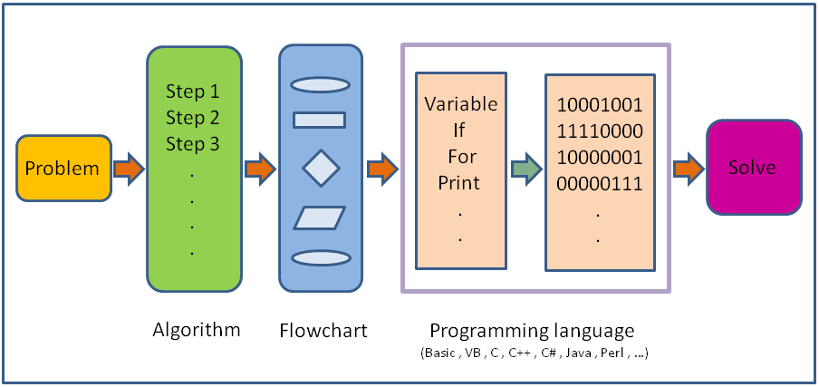
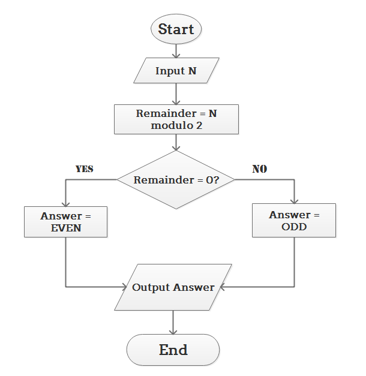
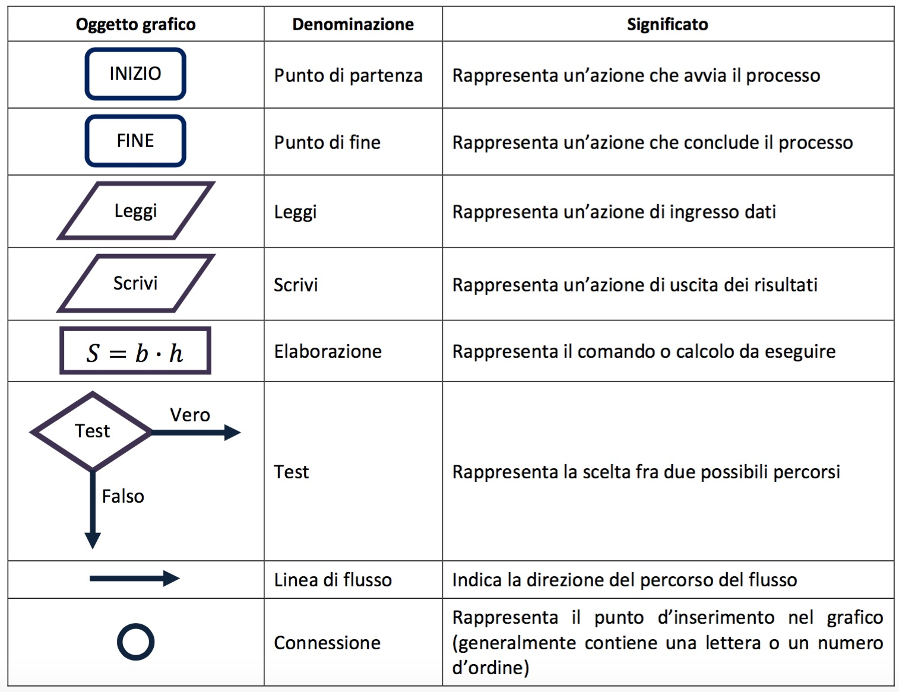
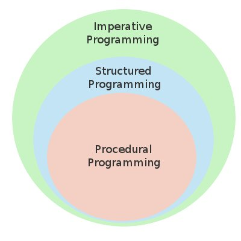

# fondamenti di programmazione

## Analisi e programmazione

* Tramite un elaboratore si possono risolvere problemi di varia natura
* Il problema deve essere formulato in modo opportuno, perché sia possibile utilizzare un elaboratore per la sua soluzione
* L’analisi e programmazione è l’insieme delle attività preliminari atte a risolvere problemi utilizzando un elaboratore
* Scopo dell’analisi: definire un algoritmo
* Scopo della programmazione: definire un programma


## Le fasi del procedimento

* Input Dati
	* Problema
	* Analisi
	* Algoritmo
	* Scelta linguaggio
	* Programma
	* Elaborazione
	* Risultati
* Output Dati

## Linguaggi di  programmazione

A cosa servono?



## I Problemi da risolvere

* La descrizione del problema non fornisce  un metodo per calcolare il risultato.
* Non tutti i problemi sono risolvibili attraverso l'uso del calcolatore. 

* La soluzione automatica non è proponibile quando
	* il problema presenta infinite soluzioni 
	* per il problema non è stato trovato un metodo risolutivo.
	* è stato dimostrato che non esiste un metodo risolutivo automatizzabile

## La risoluzione di un problema

* È il processo che  dato un problema ed individuato un metodo risolutivo:
* trasforma i dati iniziali nei corrispondenti risultati finali.

* Se tale processo può essere definito come  un insieme ordinato di azioni elementari, 
esprimibili mediante istruzioni comprensibili da un elaboratore, 
* allora esso  può essere svolto da un elaboratore.

## Quali problemi possiamo risolvere
* Emissione di certificati e report
* Gestione dei c/c di un istituto di credito
* Prenotazioni su internet
* Somma di due numeri interi
* Calcolare il massimo comun divisore fra due numeri dati.
* Dato un’insieme di parole, metterle in ordine alfabetico.
* Calcolare l'intersezione di due insiemi.
* Dato un elenco di nomi e relativi numeri di telefono trovare il numero di telefono di una determinata persona
* Dati gli archivi dei dipendenti di un’azienda, calcolare lo stipendio medio del dipendente dell’azienda.
* Dati a e b, risolvere l'equazione ax+b=0
* ...

## Ricapitolando
* Algoritmo: elenco finito di istruzioni, che specificano le operazioni eseguendo le quali si risolve un problema
	* Un algoritmo non può essere eseguito direttamente dall’elaboratore
* Linguaggio di programmazione: linguaggio rigoroso che permette la formalizzazione di un algoritmo in un programma
* Programma: ricetta che traduce l’algoritmo ed è direttamente comprensibile e quindi eseguibile da parte di un elaboratore

## Proprietà degli algoritmi

* Eseguibile
* Non ambiguo
* Finito
* Generalizzabile
* Efficiente
* Deterministico
* Completo



## Proprietà degli algoritmi 2

* Eseguibilità: ogni “istruzione” deve essere eseguibile da parte dell’esecutore dell’algoritmo;
* Non Ambiguità: ogni istruzione deve essere univocamente interpretabile dall'esecutore
* Finitezza: il numero totale di azioni da eseguire, per ogni insieme di dati di ingresso, è finito.
* se almeno una delle 3 proprietà non è soddisfatta, la sequenza non è un algoritmo.
* Generalità: corretto funzionamento dell'algoritmo anche variando alcuni aspetti del problema (ad esempio, la dimensione dell'insieme dei dati, il tipo dei * dati, ecc.)
* Efficienza: tanto minore è il numero di azioni eseguite per la risoluzione del problema, tanto maggiore è l'efficienza.
* Determinismo: possibilità di prevedere esattamente prima dell'esecuzione la sequenza di azioni che verranno eseguite, per ogni insieme di dati.

## Algoritmi e Programmi

Se l'esecutore e` un elaboratore elettronico:
* È necessario conoscere l'insieme di istruzioni che è in grado di interpretare
* È necessario conoscere quali tipi di informazioni (dati) è in grado di rappresentare
* È necessario conoscere le caratteristiche del linguaggio di programmazione scelto


Dato un problema P, la sua soluzione può essere ottenuta mediante l’uso del calcolatore, compiendo i seguenti passi:
* individuazione di un metodo risolutivo
* scomposizione del procedimento in insieme ordinato di azioni: algoritmo
* rappresentazione dei dati e dell'algoritmo attraverso un linguaggio di programmazione comprensibile per l’elaboratore: programma

Si ottiene cosi` il PROGRAMMA, che potrà essere eseguito dall'elaboratore per risolvere automaticamente ogni istanza del problema P.

## Algoritmi equivalenti

Due algoritmi si dicono equivalenti quando:
* hanno lo stesso dominio dei dati (dominio di ingresso);
* hanno lo stesso dominio dei risultati (dominio di uscita);
* in corrispondenza degli stessi valori nel dominio di ingresso producono gli stessi valori nel dominio di uscita

Due algoritmi equivalenti:
* forniscono lo stesso risultato
* possono essere profondamente diversi
* possono avere differente efficienza

## Rappresentare algoritmi


* un diagramma di flusso descrive le azioni da eseguire ed il loro ordine di esecuzione.
* ad ogni tipo di azione corrisponde ad un simbolo grafico (blocco) diverso.
* ogni blocco ha un ramo in ingresso ed uno o più rami in uscita; collegando tra loro i vari blocchi attraverso i rami, si ottiene un diagramma di flusso
* un diagramma di flusso appare, quindi, come un insieme di blocchi, collegati fra loro da linee orientate che specificano la sequenza in cui i blocchi * devono essere eseguiti: flusso del controllo di esecuzione.

## Oggetti grafici per rappresentare algoritmi



## Quanti Linguaggi...


## … e quanti paradigmi di prgrammazione



Un paradigma di programmazione è uno stile fondamentale di programmazione utile per portare ordine e criteri di lavoro più efficienti nella produzione dei programmi 

### programmazione procedurale

* In informatica la programmazione procedurale è un paradigma di programmazione che consiste nel creare dei blocchi di codice sorgente, identificati da un nome e racchiusi da dei delimitatori, che variano a seconda del linguaggio di programmazione; 
questi sono detti anche sottoprogrammi (in inglese subroutine) procedure o funzioni, a seconda del linguaggio e dei loro ruoli all'interno del linguaggio stesso. 
* Il nome deriva dal linguaggio COBOL, che è stato il primo ad utilizzare questo concetto.

### programmazione imperativa

* In informatica, la programmazione imperativa è un paradigma di programmazione secondo cui un programma viene inteso come un insieme di istruzioni (dette anche direttive o comandi), ciascuna delle quali può essere pensata come un "ordine" che viene impartito alla macchina virtuale del linguaggio di programmazione utilizzato. 
* Da un punto di vista sintattico, i costrutti di un linguaggio imperativo sono spesso identificati da verbi all'imperativo, per esempio:
	* 1: read i
	* 2: print i
	* 3: goto 1

## La programmazione strutturata

* La programmazione strutturata  è un paradigma emerso nella seconda metà degli anni '60, che ha introdotto i concetti fondamentali che sono alla base di tutti gli altri paradigmi successivi
* È una metodologia alternativa alla programmazione basata sul salto incondizionato (o goto) dei primi linguaggi di programmazione caratterizzato da codice praticamente incomprensibile spesso definito spaghetti code per la sua natura ingarbugliata. 
* le sole tre strutture fondamentali: 
	* Struttura di sequenza 
	* Struttura di selezione (o alternativa)
	* Struttura di iterazione (o ciclo, ripetizione).

## Teorema di Jacopini-Bohm (1966)

Un qualsiasi algoritmo può essere espresso utilizzando esclusivamente le tre strutture di controllo: 
* sequenza, 
* selezione 
* e iterazione. 

## La programmazione funzionale

* le funzioni sono funzioni matematiche: per un dato input restituiscono sempre lo stesso risultato;
* le funzioni non modificano i dati ricevuti in input, ma restituiscono sempre nuovi valori;
* le funzioni possono essere passate come parametro e restituite da altre funzioni, e possono essere combinate tra di loro.

	Alcune funzioni sono definite non pure: sono funzioni che producono effetti collaterali:

	una interazione con il mondo esterno diversa dal ricevimento dei valori di input e dalla restituzione del risultato. 

	Ad esempio una funzione senza parametri che abbia come valore di ritorno la data corrente

Ne discende che:
* Una funzione senza parametri non è pura o non ha senso
* Una funzione senza un output non è pura

Invece le funzioni pure garantiscono la trasparenza referenziale: la capacità di sostituire una espressione con il suo risultato, mantenendo la correttezza dell’applicazione. 

Sfruttando la trasparenza referenziale c’è la possibilità di utilizzare una tecnica detta memoization, che consiste nel mettere in cache risultati di funzioni che hanno un certo costo computazionale.

var funzioneMemoizzata = memoize(funzioneConCalcoliPesanti);

## Programmazione ad oggetti

Procedurale vs OOP

* Nella programmazione procedurale, il codice è centrale e i dati sono subordinati. In altre parole, abbiamo programmi che agiscono sui dati che di solito non sono strettamente collegati.

* Nella programmazione a oggetti, gli oggetti sono l'elemento centrale. Un oggetto consiste nei dati (attributi, proprietà, ...) e nel codice che opera su tali dati(metodi, costruttore, ...), ed essi sono strettamente collegati. è il concetto di incapsulamento, che permette anche di nascondere l'implementazione interna.

### Per esempio, abbiamo un numero e vogliamo raddoppiarlo. Nel modo procedurale faremmo:

```java
n = n * 2
```
#### Il codice moltiplica n per 2 e registra il risultato in n.

### Nella programmmazione orientata agli oggetti, si invia un "messaggio" all'oggetto chiamando un metodo per raddoppiare:

```java
n.double();
```
### Il vantaggio di questa tecnica è definito polimorfismo. Se il programma richiede di replicare la procedura su un  oggetto di tipo string come "bob", nel modoprocedurale occorre invocareuna nuova funzione con un codice e un nome differente.

### Con la OOP, puoi creare un oggetto di tipo stringa che accetta la chiamata al metodo double(), ma lo implementa in maniera differente. 

```java
class Operazioni{
	

	public int double(int n){
		return n * 2;
	}

	public String double(String s){
		return s+s;
	}

}
```
[vai alla sezione programmazione a oggetti](OOP.md)