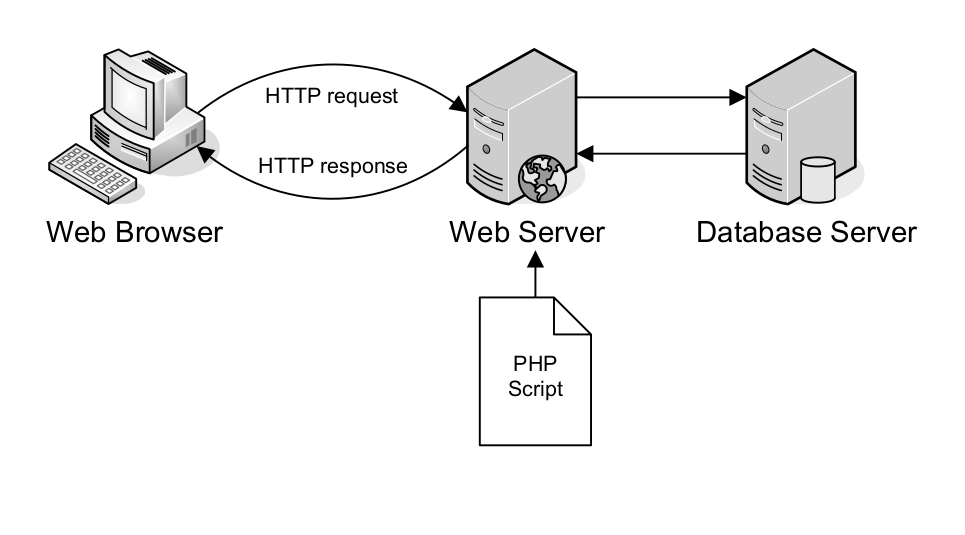
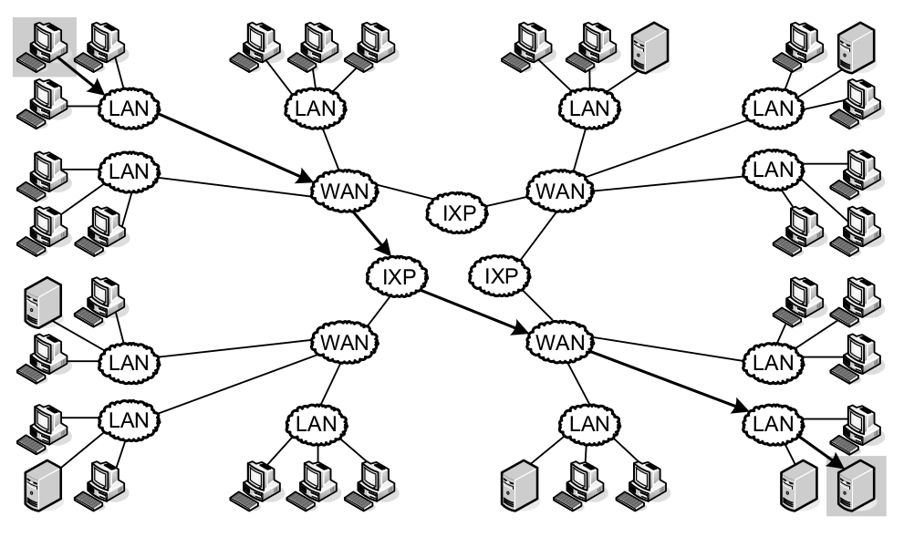

## Architettura del Web

L'architettura del web è un aspetto fondamentale per comprendere come le applicazioni web sono progettate e come comunicano tra loro. Esploriamo alcuni concetti chiave:

---

### 1. **Client-Server:**

- **Descrizione:** È il modello fondamentale del web. Il client (solitamente un browser) fa richieste al server, che elabora la richiesta e invia indietro i dati.
- **Vantaggi:** Separazione delle responsabilità, facilità di scalabilità e manutenzione.

---

### 2. **Protocolli di Comunicazione:**

- **HTTP (HyperText Transfer Protocol):**
  - Protocollo standard per la trasmissione di dati sul web.
- **HTTPS (HTTP Secure):**
  - Versione sicura di HTTP utilizzando SSL/TLS per crittografare i dati.

---

### 3. **DNS (Domain Name System):**

- **Descrizione:** Sistema di traduzione di nomi di dominio in indirizzi IP.
- **Funzione:** Permette agli utenti di accedere ai siti web utilizzando nomi di dominio anziché indirizzi IP numerici.

---

### 4. **Stateless vs. Stateful:**

- **Stateless:**
  - Ogni richiesta dal client al server è indipendente dalle precedenti. Il server non mantiene lo stato tra le richieste.
- **Stateful:**
  - Il server mantiene lo stato delle richieste precedenti dell'utente. Solitamente realizzato attraverso sessioni.

---

### 5. **RESTful Architecture:**

- **Descrizione:** Stile architetturale per la progettazione di servizi web basati su risorse.
- **Principi REST:**
  - Uso di risorse identificate tramite URL.
  - Utilizzo dei metodi HTTP (GET, POST, PUT, DELETE) per operare su risorse.

---

### 6. **API (Application Programming Interface):**

- **Descrizione:** Insieme di regole e strumenti per costruire software e applicazioni.
- **Tipi di API:**
  - **API Web:** Consentono a servizi diversi di comunicare via web.
  - **API RESTful:** Implementano principi REST.

---

### 7. **Microservizi:**

- **Descrizione:** Approccio architetturale in cui un'applicazione è composta da servizi indipendenti e autosufficienti.
- **Vantaggi:** Scalabilità, facilità di aggiornamento, resistenza ai guasti.

---

### 8. **Websockets:**

- **Descrizione:** Protocollo di comunicazione bidirezionale in cui il server può inviare informazioni al client in qualsiasi momento.
- **Utilizzo:** Per applicazioni che richiedono aggiornamenti in tempo reale.

---

### 9. **CDN (Content Delivery Network):**

- **Descrizione:** Rete di server distribuiti globalmente per migliorare la velocità di caricamento dei contenuti.
- **Utilità:** Riduzione della latenza, aumento delle prestazioni.

---

### 10. **GraphQL:**

- **Descrizione:** Linguaggio di interrogazione per le API, permette alle applicazioni di richiedere solo i dati necessari.
- **Vantaggi:** Riduzione del sovraccarico di dati, miglioramento delle prestazioni.

La comprensione di questi concetti è essenziale per la progettazione e lo sviluppo di applicazioni web efficienti e scalabili. L'architettura del web è in costante evoluzione, e l'adozione di nuove tecnologie può influenzare la progettazione di sistemi web moderni.

---

### static web

---

### dynamic web

---

### web architecture

